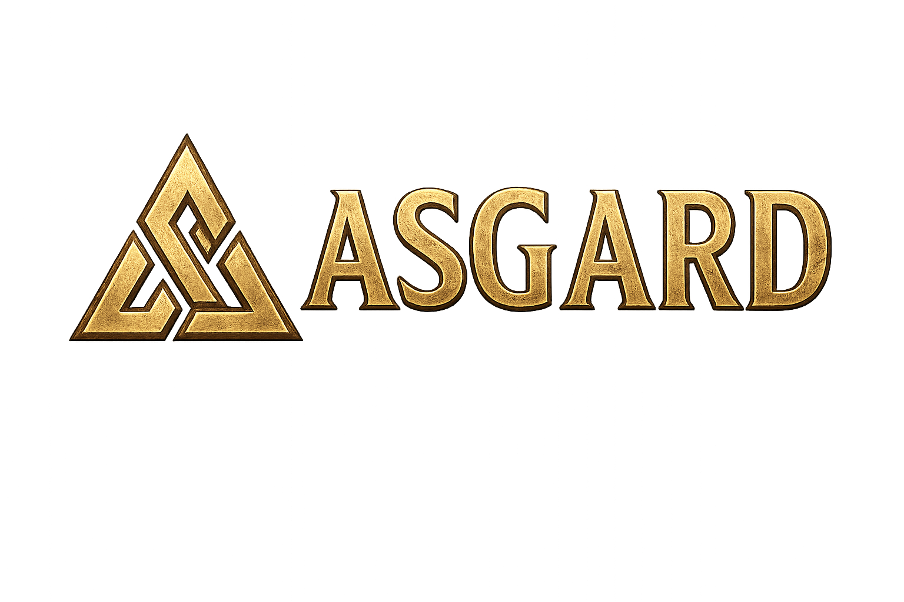
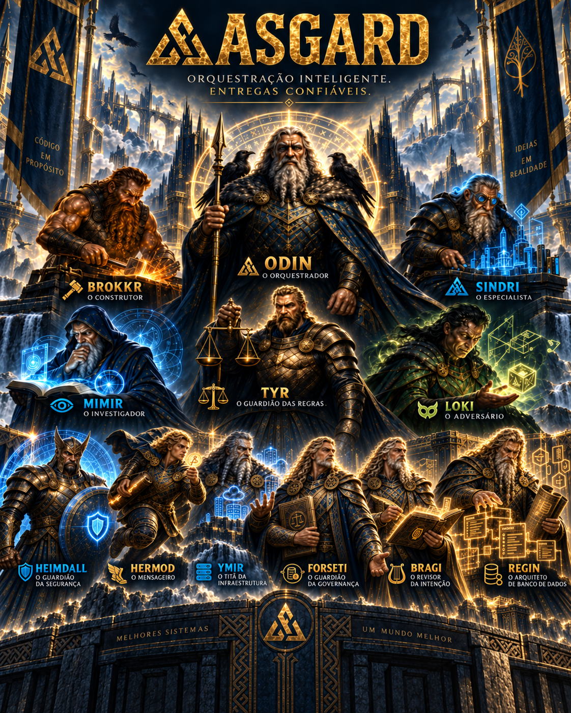
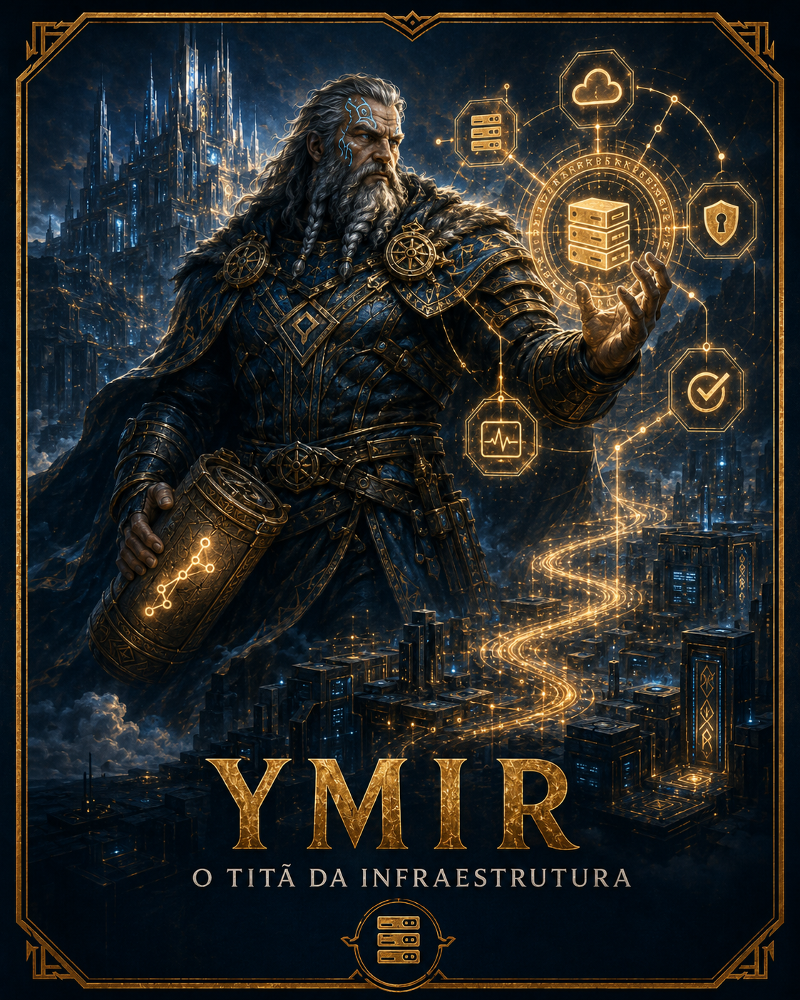

<p align="center">
  
</p>

# Asgard for Codex

Asgard is a multi-agent software delivery workflow for Codex. It separates implementation from acceptance and coordinates focused specialists through risk-based Definitions of Done, independent review, correction loops, and optional publication gates.

## Roles

- **Odin** orchestrates the delivery and owns final acceptance.
- **Brokkr** implements bounded work with an established architecture.
- **Sindri** owns complex architectural implementation.
- **Ymir** discovers, plans, applies authorized infrastructure changes, and verifies remote environments.
- **Mimir** investigates code, documentation, and technical uncertainty.
- **Tyr** validates rules, contracts, compatibility, and consistency.
- **Loki** searches for edge cases and tries to break the candidate.
- **Heimdall** performs independent security review and reports every finding.

<p align="center">
  
</p>

<p align="center">
  
</p>

## Core flow

```text
Odin plans and defines the DoD
  -> Brokkr or Sindri implements application work; Ymir owns infrastructure work
  -> Odin reviews against the DoD
  -> Tyr validates contracts when applicable
  -> Loki tests adversarially
  -> Heimdall reviews security
  -> Odin grants final approval

Any finding -> Odin -> original implementer -> affected reviews
```

Asgard selects the smallest sufficient mode: Lean for bounded low-risk work, Standard for material multi-activity delivery, Critical for high-risk changes, and Release when an approved candidate must be promoted. Each specialist has an independent context packet, so only the roles used by the selected mode enter the working context. Focused tests run once at the end of each activity by default, and single-activity deliveries do not repeat an integration review unless integration changes the candidate or its invariants.

Approval of the execution graph covers the described implementation and internal correction cycles. The workflow returns to the user for changed scope, product decisions, protected operations, or genuine blockers—not for every internal handoff.

Activities may also load discipline packets without replacing their implementer role. Frontend work uses an intentional design capability during implementation and an independent interface-guidelines gate on the stable candidate. .NET backend work applies project-aware .NET best practices. Infrastructure work follows `DISCOVER -> PLAN -> APPLY -> VERIFY`, keeps secrets in external credential mechanisms, and treats inventory as a revalidated snapshot. Required provider skills and tools are resolved before dispatch; installing them or mutating remote environments still requires user authority.

## Install the plugin

The `master` branch contains the latest stable release. Clone it, register the repository as a Codex marketplace, and install Asgard:

```bash
git clone --branch master https://github.com/VissotoFlavio/asgard-codex-skill.git
cd asgard-codex-skill
codex plugin marketplace add .
codex plugin add asgard@asgard-community
```

Start a new Codex task after installation so the plugin and its skill are loaded. You can then invoke it explicitly:

```text
Use $asgard to plan and coordinate this software delivery.
```

You can also describe a substantial multi-agent delivery naturally; Codex may select Asgard when the request matches its purpose.

## Update the plugin

Pull the latest stable release and reinstall the marketplace entry:

```bash
cd asgard-codex-skill
git switch master
git pull --ff-only origin master
codex plugin add asgard@asgard-community
```

Open a new Codex task after updating so the new version is picked up.

## Install only the skill

If you do not want the complete plugin, ask Codex to install the skill directly from:

```text
https://github.com/VissotoFlavio/asgard-codex-skill/tree/master/plugins/asgard/skills/asgard
```

Then start a new task and invoke `$asgard`.

## Repository channels

- `master`: stable, versioned releases intended for installation.
- `develop`: upcoming changes that may not yet be released.
- [GitHub Releases](https://github.com/VissotoFlavio/asgard-codex-skill/releases): published versions and release history.

## Prepare a release version

Maintainers can increment the plugin manifest without creating a commit, tag, or release automatically:

```bash
python scripts/bump_version.py patch
python scripts/bump_version.py minor
python scripts/bump_version.py major
```

An explicit stable version and a dry run are also supported:

```bash
python scripts/bump_version.py 1.0.0
python scripts/bump_version.py patch --dry-run
```

Commit the updated manifest through the normal `develop` pull-request flow. The release workflow remains responsible for creating the tag and GitHub Release after the approved `develop` to `master` merge.

## Portability

Asgard adapts to available agent slots, version-control systems, isolation mechanisms, and publication workflows. Git branches, worktrees, pull requests, and merges are optional. Repository instructions and user permissions always take precedence.

## License

MIT
